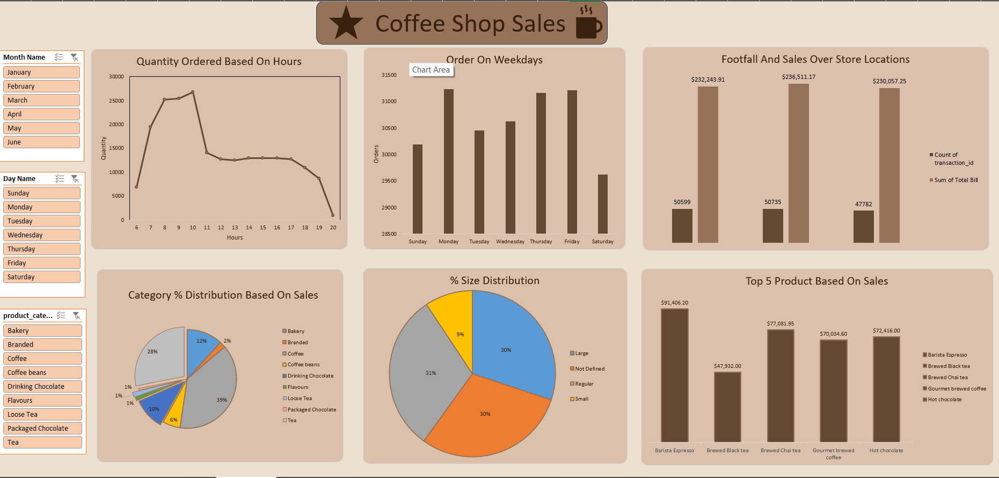

# ☕ Coffee Shop Sales Analysis Dashboard (Excel)

An interactive **Microsoft Excel Dashboard** built using the **Coffee Shop Sales Dataset** from **Maven Analytics**. This project analyzes transactional sales data from a coffee shop to uncover customer purchasing patterns, sales trends, and business insights through dynamic visualizations and interactive dashboards. :contentReference[oaicite:0]{index=0}

---

## 📌 Project Objective

The objective of this project is to analyze coffee shop sales data to gain actionable business insights that help understand customer behavior, optimize store performance, identify sales trends, and support data-driven business decisions. :contentReference[oaicite:1]{index=1}

---

## 📊 Dataset Information

- **Source:** Maven Analytics Data Playground
- **Dataset:** Coffee Shop Sales
- **Records:** 149,116+ Transactions
- **Fields:** 18+ Columns
- **File Format:** Microsoft Excel (.xlsx)
- **Industry:** Retail / Food & Beverage

---

## 🛠️ Tools & Technologies

- Microsoft Excel
- Pivot Tables
- Pivot Charts
- Slicers
- Conditional Formatting
- Data Cleaning
- Dashboard Design
- Business Analytics

---

## 📂 Project Structure

```text
📦 Coffee Shop Sales Analysis
├── 📄 Coffee Shop Sales Analysis.xlsx
├── 📄 Coffee Shop Sales Raw Data.xlsx
├── 🖼️ Dashboard Preview.png
└── 📄 README.md
```

---

## 📊 Dashboard Features

The dashboard provides interactive insights into:

- ☕ Quantity Ordered by Hour
- 📅 Orders by Weekday
- 🏪 Footfall & Sales by Store Location
- 🥧 Product Category Sales Distribution
- 🥤 Product Size Distribution
- 🏆 Top 5 Products by Sales
- 🎯 Interactive Filters (Month, Day & Product Category)

---

## ❓ Business Questions Answered

- How do sales vary by **day of the week** and **hour of the day**?
- Are there any **peak sales hours**?
- Which **store location** generates the highest revenue?
- Which **product categories** contribute the most to sales?
- Which **coffee size** is most popular?
- What are the **Top 5 products** based on sales?
- How do customer purchasing patterns change across weekdays?
- How does product demand vary throughout the day? :contentReference[oaicite:2]{index=2}

---

## 📈 Dashboard Insights

- 📌 Sales peak during the **morning hours (8 AM – 10 AM)**.
- 📌 Weekdays generally receive more customer orders than weekends.
- 📌 Sales and customer footfall vary across different store locations.
- 📌 Coffee and Tea products contribute a major share of total sales.
- 📌 Regular and Large cup sizes account for the highest number of orders.
- 📌 A small number of products generate a significant portion of total revenue.

---

## 💡 Business Recommendations

- Increase staffing during peak morning hours to improve customer service.
- Launch promotional offers during low-demand hours to boost sales.
- Ensure high-demand products remain well stocked.
- Expand inventory for the most popular beverage sizes.
- Use loyalty programs to encourage repeat purchases.
- Focus marketing campaigns on top-selling products and high-performing store locations.

---

## 📷 Dashboard Preview




---

## 📊 Dashboard Components

- Interactive Excel Dashboard
- Pivot Tables
- Pivot Charts
- Dynamic Slicers
- KPI-Based Visualizations
- Category-wise Analysis
- Store-wise Sales Analysis
- Time-based Sales Analysis

---

## 🚀 Skills Demonstrated

- Data Cleaning
- Data Analysis
- Business Intelligence
- Dashboard Development
- Microsoft Excel
- Pivot Tables
- Pivot Charts
- Data Visualization
- Interactive Reporting
- Business Insight Generation

---

## 📚 Key Learning Outcomes

Through this project, I learned how to:

- Clean and transform raw transactional data.
- Create interactive dashboards in Excel.
- Analyze customer purchasing behavior.
- Visualize sales trends using charts and KPIs.
- Generate actionable business insights from retail data.
- Design professional dashboards for business reporting.

---

## 🔮 Future Improvements

- Add Profit & Margin Analysis
- Build an Interactive Power BI Dashboard
- Automate Data Refresh with Power Query
- Add Sales Forecasting
- Create Customer Segmentation Dashboard
- Include Inventory & Product Performance Analysis

---

## 📚 Dataset Source

**Maven Analytics – Coffee Shop Sales Dataset**

This dataset is provided by **Maven Analytics Data Playground** for learning and portfolio projects.

---

## 👨‍💻 Author

**Dhananjay Bachal**

Electronics & Telecommunication Engineering Student | Aspiring Data Analyst

- 💼 LinkedIn: https://www.linkedin.com/in/dhananjay-bachal-09a6aa2b5/
- 🐙 GitHub: https://github.com/DhananjayBachal

---

## ⭐ Support

If you found this project helpful, please consider giving it a **⭐ Star** on GitHub. Your support motivates me to build more data analytics projects!

---

**Thank you for visiting this repository! ☕📊**